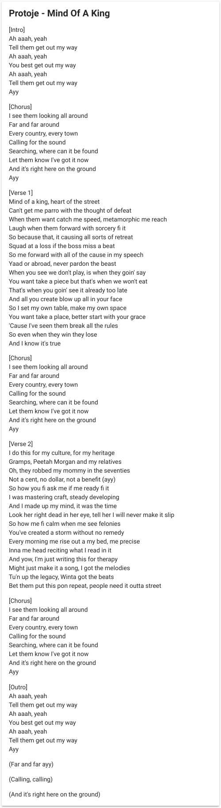

# genius-lyrics

Custom component for Home Assistant to fetch song lyrics from [Genius](https://genius.com)
by tracking media player entities.  Component allows service calls for custom automations.


## Installation

### With HACS
1. Open HACS Settings and add this repository (https://github.com/robert-alfaro/genius-lyrics)
as a Custom Repository (use **Integration** as the category).
2. The `Genius Lyrics` page should automatically load (or find it in the HACS Store).
3. Click `Install`

### Manual
Copy the `genius_lyrics` directory from `custom_components` in this repository, and place inside your
Home Assistant installation's `custom_components` directory.


## Setup
1. Create a Genius.com access token:
	1. Sign up for a free account at [genius.com](https://genius.com) if you don't have one.
	2. Open the [New API Client](https://genius.com/api-clients/new) page and fill in App Name, App Website URL,
	   and Redirect URL (this won't be used).
	3. Once you've saved the new client, click the button to generate a `Client Access Token` (record this somewhere safe).
2. Install this integration
3. Enable Genius Lyrics in `configuration.yaml` by adding the following (*substitute your access token from step 1*):

**NOTE: Media player `foobar` is just an example. Replace it with your media player's entity name.**

	```yaml
    genius_lyrics:
      access_token: "3SxSxqZJOtz5fYlkFXv-12E-mgripD0XM7v0L091P3Kz22wT9ReCRNg0qmrYeveG"
      entities:
        - media_player.foobar
	```
    The above configuration will create a sensor entity `sensor.foobar_lyrics`.

4. Create markdown card in lovelace:

    ```yaml
    type: vertical-stack
    cards:
      - type: media-control
        entity: media_player.foobar
      - type: conditional
        conditions:
          - entity: sensor.foobar_lyrics
            state: 'on'
        card:
          type: markdown
          content: >-
            ## {{ states.sensor.foobar_lyrics.attributes.media_artist }} - {{ states.sensor.foobar_lyrics.attributes.media_title }}

            {{ states.sensor.foobar_lyrics.attributes.media_lyrics }}
    ```

    The above lovelace card groups the media player and lyrics sensor together.
    The conditional portion will hide the lyrics sensor when the media player is off.


### Example service call
##### JSON
```json
{
 "media_artist":"Protoje",
 "media_title":"Mind of a King",
 "entity_id":"sensor.foobar_lyrics"
}
```

##### YAML
```yaml
media_artist: "Protoje"
media_title: "Mind of a King"
entity_id: sensor.foobar_lyrics
```


## Screenshot


---

Thanks to
 - @johnwmillr for `lyricsgenius` python package!