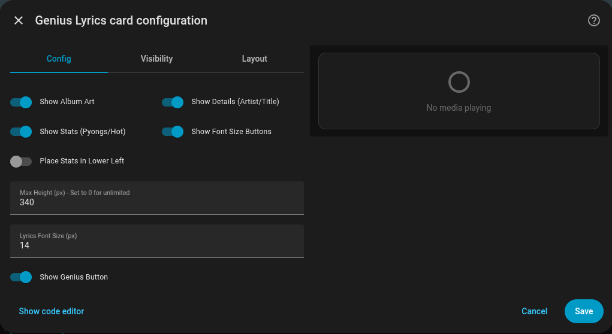
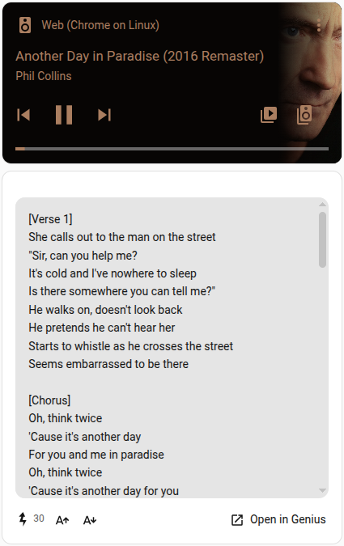
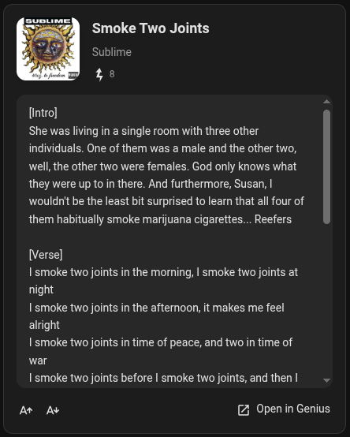
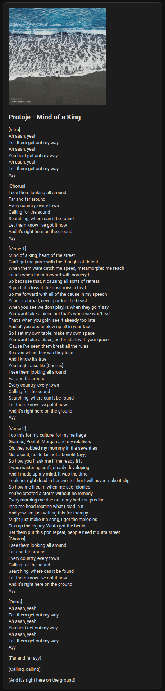

# genius-lyrics

Custom component for Home Assistant to fetch song lyrics from [Genius](https://genius.com)
by tracking media player entities. Component allows service calls for custom automations.

## Installation

### With HACS

1. Open HACS Settings and add this repository (https://github.com/robert-alfaro/genius-lyrics)
   as a Custom Repository (use **Integration** as the category).
2. The `Genius Lyrics` page should automatically load (or find it in the HACS Store).
3. Click `Install`

### Manual

Copy the `genius_lyrics` directory from `custom_components` in this repository, and place inside your
Home Assistant installation's `custom_components` directory.

## Setup

1. Install this integration via HACS or manually and reboot Home Assistant.
2. Configure `Genius Lyrics` via integrations page  or press the blue button below. 

    [](https://my.home-assistant.io/redirect/config_flow_start/?domain=genius_lyrics)

3. Add the built-in `Genius Lyrics Card` in Lovelace (type: `custom:genius-lyrics-card`).
   The integration now auto-registers the card module resource.

4. All created sensor are named with the following format: `sensor.genius_lyrics_<media player name>_lyrics`.

## Built-in Card

This integration ships a built-in Lovelace card that is auto-installed and auto-registered:
- Card type: `custom:genius-lyrics-card`
- Resource URL (managed automatically): `/local/genius_lyrics/genius-lyrics-card.js`

### Card Features

- ✨ Visual editor support (no YAML required)
- 🎨 Album art, artist/title, and stats display controls
- 📍 Stats placement options (`header` or `bottom_left`)
- 🔠 Built-in font-size controls (`+/-`) with configurable default font size
- 📝 ~~Lyrics annotations with inline highlight and tooltip/modal behavior~~
- 🧠 Smart empty states (`No media playing`, `No lyrics found`)

### Card Config Example

#### Visual Editor



#### YAML

```yaml
type: custom:genius-lyrics-card
entity: sensor.genius_lyrics_foobar_lyrics
show_image: true
show_details: true
show_stats: true
stats_position: header
show_font_controls: true
font_size: 14
max_height: 400
show_genius_button: true
```

### Card Config Options

| Option | Type | Default | Description |
|---|---|---|---|
| `entity` | string | Required | Lyrics sensor entity |
| `show_image` | boolean | `true` | Show album artwork |
| `show_details` | boolean | `true` | Show artist/title row |
| `show_stats` | boolean | `true` | Show stats row (`pyongs` / `hot`) |
| `stats_position` | string | `header` | `header` or `bottom_left` |
| `show_font_controls` | boolean | `true` | Show bottom-left font size buttons |
| `font_size` | number | `14` | Lyrics text size in px (`10..30`) |
| `max_height` | number | `400` | Max lyrics panel height in px (`0` = unlimited) |
| `show_genius_button` | boolean | `true` | Show “Open in Genius” button |

### Screenshots




### Example service call

Service optionally accepts `entity_id`. Returns response when omitted, otherwise updates sensor entity attributes.

##### JSON

```json
{
  "media_artist": "Protoje",
  "media_title": "Mind of a King",
  "entity_id": "sensor.genius_lyrics_foobar_lyrics"
}
```

##### YAML

```yaml
media_artist: "Protoje"
media_title: "Mind of a King"
entity_id: sensor.genius_lyrics_foobar_lyrics
```

## Markdown Card Example

>*Below, media player `foobar` is just an example. Replace it with your media player's entity name.*
   
```yaml
type: vertical-stack
cards:
 - type: media-control
   entity: media_player.foobar
 - type: conditional
   conditions:
     - entity: sensor.genius_lyrics_foobar_lyrics
       state: "on"
   card:
     type: markdown
     content: >-
       

       ## {{ states.sensor.genius_lyrics_foobar_lyrics.attributes.media_artist }} - {{ states.sensor.genius_lyrics_foobar_lyrics.attributes.media_title }}

       {{ states.sensor.genius_lyrics_foobar_lyrics.attributes.media_lyrics }}
```

The above markdown example groups the media player and lyrics sensor together.
The conditional portion will hide the lyrics sensor when the media player is off.



---

Thanks to

- @johnwmillr for `lyricsgenius` python package!

